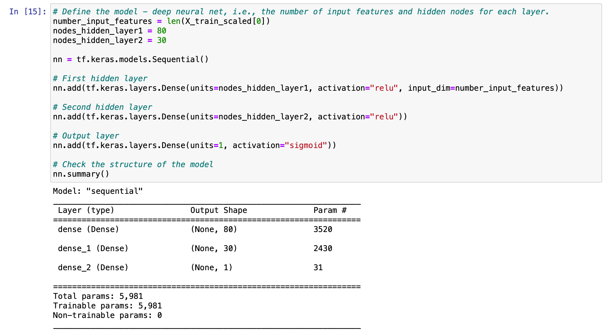
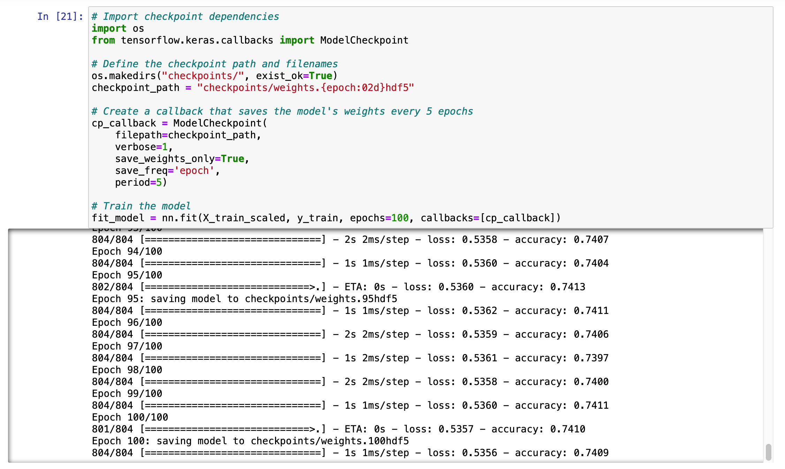
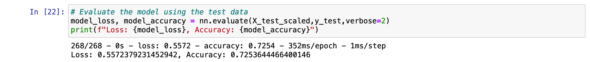
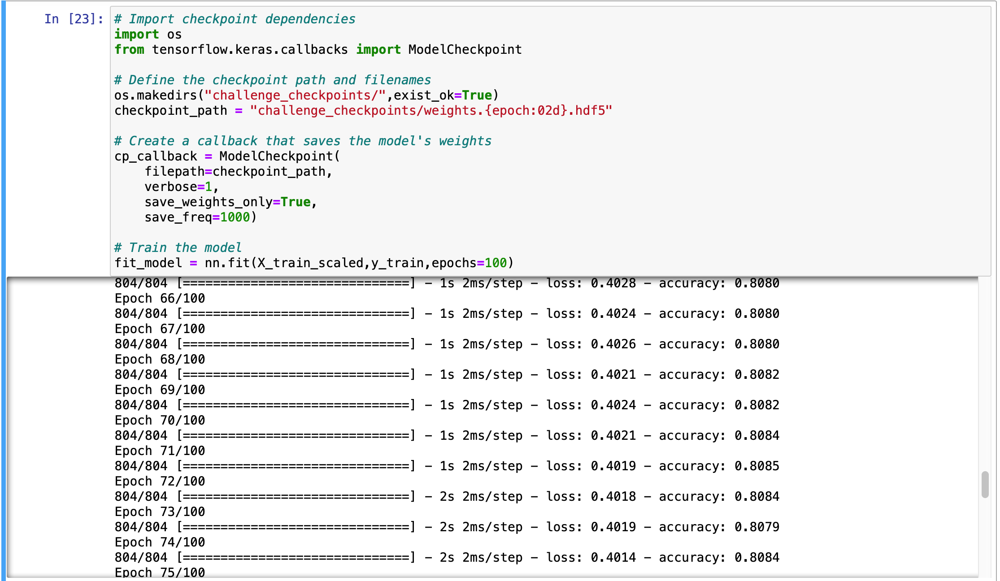
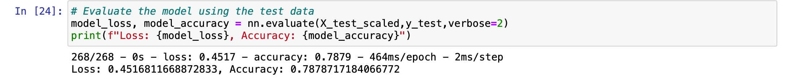

## Neural_Network_Charity_Analysis

## Overview of the analysis: 

The purpose of this project was to use my knowledge on deep learning (Neural Networks and Deep Learning Models) to create a binary classifier that is capable of predicting whether applicants will be successful if funded by Alphabet Soup. The dataset used was `Alphabet Soup Charity dataset (charity_data.csv)` and tools and libraries used were as follows:
* Jupyter notebook
* Python
* Pandas
* Sklearn Library
* Tensorflow

## Results: 

* Data Preprocessing
  * What variable(s) are considered the target(s) for your model?
  
  The target variable is considered to be `IS_SUCCESSFUL` binary variable for our deep learning neural network.
  * What variable(s) are considered to be the features for your model?
  
  The features are considered to be `APPLICATION_TYPE`, `AFFILIATION`, `CLASSIFICATION`, `USE_CASE`, `ORGANIZATION`, `STATUS`, `INCOME_AMT`,        `SPECIAL_CONSIDERATIONS`, `ASK_AMT` or our deep learning neural network.
  
  * What variable(s) are neither targets nor features, and should be removed from the input data?
  
  The EIN and NAME columns are neither targets nor features, and were removed from the input data.
  
  
* Compiling, Training, and Evaluating the Model
  * How many neurons, layers, and activation functions did you select for your neural network model, and why?
  
  
  
 The input data has 43 features, 2 hidden layers and one output layer with a unique neuron for the binary classification. The  ReLU activation function was used for the 1st and 2nd hidden layers followed by the Sigmoid activation function.The model was complied with the optimizer as `adam` and the loss function as `binary_crossentropy`.
 
  * Were you able to achieve the target model performance?
  
 
 
 Running the initial non_optimized model gave an accuracy score of 72% which was below the target model performance of 75%
 
  * What steps did you take to try and increase model performance?
  
 
   
 Running the ptimized model gave an accuracy score of 78% which was above the target model performance of 75%.
 
 
 The steps taken included retaining the `NAME` column, binning the name_counts <=5 as "Other", creating a OneHotEncoder for the NAME variable from the new bins therefore having 398 input features for the new optimized model. 
  
  
## Summary: 
Optimizing the model by dropping fewer columns, creating more bins for rare occurrences in columns and
increasing  the number of values for each bin improved model performance.
